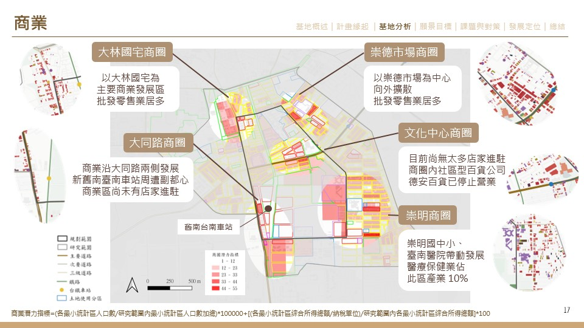

# Google-Map-API-web-crawler

▌Introduction

**Integration Plan of "Southern Tainan Suburb Center and Surrounding Areas" in East District of Tainan City**

**(臺南市東區南臺南副都心與周邊地區整合計畫)** [Website Link](https://www.behance.net/gallery/166339751/Integration-Plan-of-Southern-Tainan-Suburb-Center-Area)

The planning area is located in the southwest of the East District of Tainan City, including Zhongxiao Vil., Dade Vil., Dafu Vil., and Chongming Vil. in the East District, with an area of about 143.427 hectares (accounting for about 11% of the East District).
The core of the planning area mainly takes the Cultural Center as the cultural base, and the Southern Tainan Station of the Taiwan Railway as the Suburb Center node, adjacent to Provincial Highway No. 1, and is an important transportation hub connecting the Southern District and Rende District in Tainan City.

Surrounded by many living circles, it should be suitable for the mixed residential and commercial development. However, the planning scope is mainly for residential use, supplemented by commercial use, and the characteristics of the Suburb Center location within the planning scope are not fully utilized. It is planned to use the new public transportation station to attract crowds, so that the wholesale and retail industries in the rezoned area can be activated, and then combined with the Future Science Museum, Tainan's Barclay Memorial Park, and the park green belt after the underground railway will be established in the future Tainan Suburb Center.

The planning area will be suitable for the circular green belt corridor for recreation, combined with the convenient transportation brought by the future construction of the MRT Blue Line and the integration of commerce at the station, the use of commercial areas will be activated to attract people to live and work here, and it is also suitable for local residents rest and live at Tainan Suburb Center.

In addition, planned changes will be made to the urban physical environment, industrial structure, functions, and land use to bring new vitality to the old settlements, and the new rezoning areas will be both livable and convenient, so as to improve the built environment of urban life, revitalize the local economy, strengthen the connection role of Suburb Center to promote the sustainable development of Tainan City and the East District.

Fig 1 Analysis Demo
  

▌Google Map API

1. *`2022_Jun-Sep_降雨量(mm)_分景點_小雨1,大雨2,強雨3.csv`*: Rainfall Data.

2. 

▌Web-Crawler

1. *`2022_Jun-Sep_降雨量(mm)_分景點_小雨1,大雨2,強雨3.csv`*: Rainfall Data.

▌Results

     
 
  * Isochrones of tourist attractions
  
     

  * Voronoi regions of Tainan weather station
